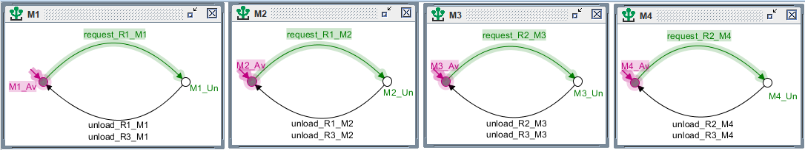

# Controle de Robôs Autônomos em um Armazém

Este repositório contém a documentação do projeto de controle supervisionado para um sistema de robôs móveis em um armazém utilizando **autômatos finitos** e a ferramenta **Supremica**.

## Descrição Geral

O projeto modela e controla um sistema onde **três robôs autônomos** transportam caixas de insumos entre um **Buffer de Entrada (BE)** e **quatro máquinas de processamento (M1, M2, M3, M4)**. O Supremica é utilizado para sintetizar um supervisor que garante a **operação segura e eficiente** dos robôs.

## Objetivos

- Utilizar o **Supremica** para a síntese do supervisor.
- Modelar autômatos para controlar as máquinas.
- Representar o comportamento dos robôs usando autômatos finitos.
- Garantir que os robôs tenham acesso ao BE.
- Definir estados e transições para o transporte de caixas entre o BE e as máquinas.
- Permitir que todas as requisições das máquinas sejam realizadas pelos robôs.
- Garantir que os robôs R1 e R2 possam falhar e o robô R3 possa substituí-los.
- Possibilitar que o sistema identifique quando os robôs R1 e R2 sejam consertados.
- Testar cenários de transporte para verificar a segurança do supervisor.
- Avaliar a performance do sistema.

## Funcionamento do Sistema

### Principais Componentes
- **Número de robôs:** 3 (R1, R2, R3 - substitui R1 ou R2 em caso de falha).
- **Número de máquinas:** 4 (M1, M2, M3, M4).
- **Buffer de Entrada (BE):** local onde os robôs retiram insumos.

### Rotas dos Robôs
- **R1:** Transporta caixas do **BE** para **M1** e **M2**.
- **R2:** Transporta caixas do **BE** para **M3** e **M4**.
- **R3:** Substitui **R1** ou **R2** em caso de falha.

## Modelagem no Supremica

O sistema foi modelado com autômatos finitos, onde os robôs e máquinas têm suas regras representadas por estados e transições.

### Eventos Controláveis
- `move_Ri_Mi`: O robô **Ri** transporta uma caixa do **BE** para a máquina **Mx**.
- `peding_request_Mi`: Solicitação de transporte pendente, que surge quando o robô **Ri** está realizando uma solicitação.
- `unload_Ri_Mi`: O robô **Ri** entrega a caixa na máquina **Mx**.
- `start_Ri: O robô **Ri** indica que está pronto para iniciar um novo ciclo de transporte.

### Eventos Não Controláveis
- `request_Ri_Mi`: Nova solicitação de transporte surge.
- `fault_Ri_RMi`: O robô **Ri** apresenta falha após receber uma requisição.
- `fault_Ri_Mi`: O robô **Ri** apresenta falha após pegar a caixa no **BE**.
- `reset`: O robô **Ri** é consertado e volta a funcionar.

### Máquinas

## Demonstração

Link de acesso ao vídeo no YouTube: 

## Desenvolvedores

    Mateus Figueiredo (mateus.figueiredo@ee.ufcg.edu.br)
    Matheus Lucas     (matheuslucas.farias@ee.ufcg.edu.br)
    Tâmara Ruth       (tamara.santos@ee.ufcg.edu.br)
